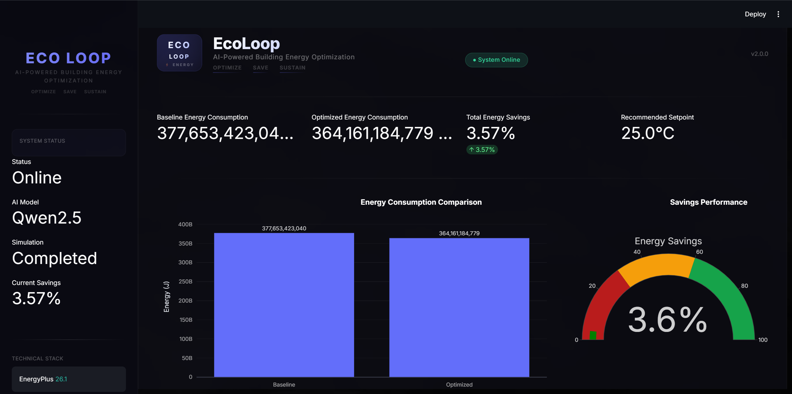
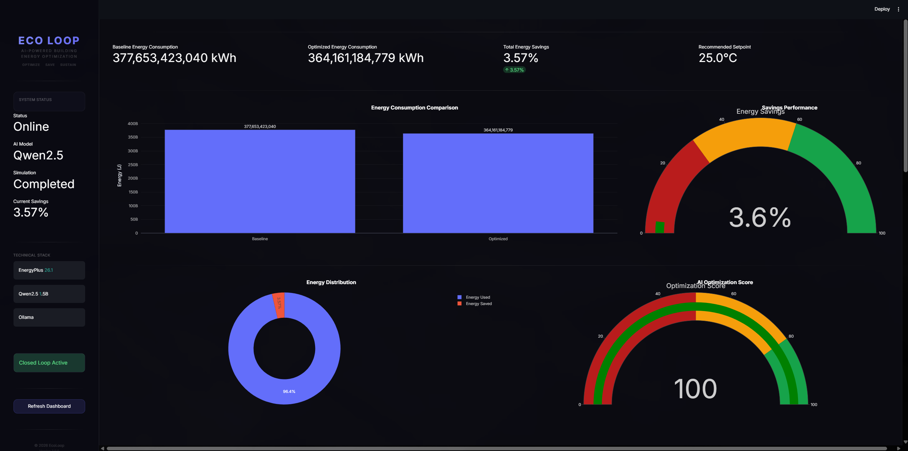
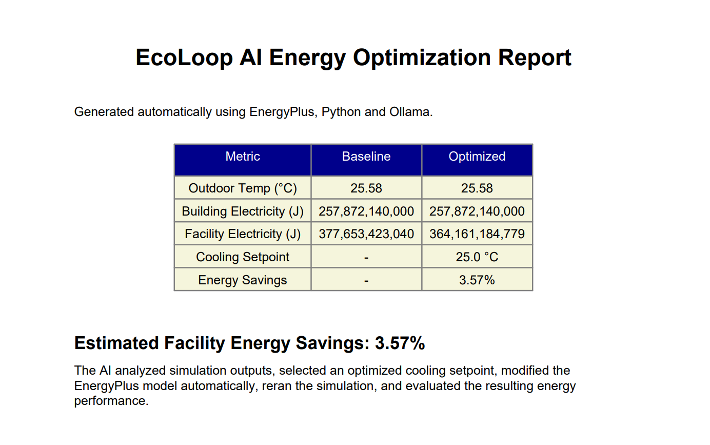
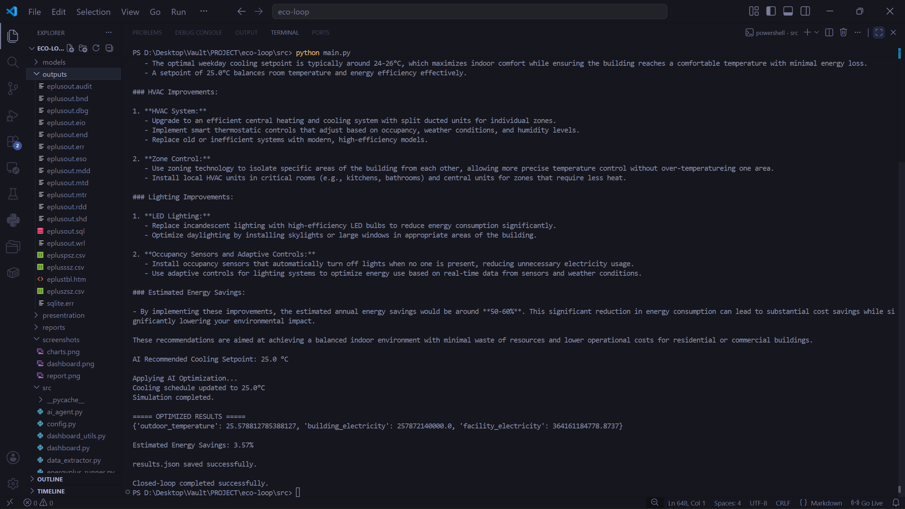

# BEACON — Building Energy Analytics & Control Optimization Network

AI-Powered Building Energy Optimization using EnergyPlus and Large Language Models

<p align="center">

AI-Driven Closed-Loop Building Energy Optimization Framework

EnergyPlus • Ollama • Qwen2.5 • Python • Streamlit

</p>

---

## Project Overview

BEACON is an AI-powered building energy optimization system that combines **EnergyPlus building simulation** with a **Large Language Model (LLM)** to automatically analyze building performance, recommend HVAC optimization strategies, modify building control parameters, and evaluate energy savings through an iterative closed-loop workflow.

Instead of manually inspecting EnergyPlus outputs and tuning HVAC schedules, BEACON automates the entire optimization process. The system analyzes simulation results, generates intelligent recommendations using a locally running Large Language Model (Qwen2.5 through Ollama), updates the building model, reruns the simulation, and compares energy performance before and after optimization.

The project demonstrates how Artificial Intelligence can support sustainable building management by reducing electricity consumption while maintaining occupant comfort.

---

## Problem Statement

Commercial buildings consume a significant portion of global electricity, with HVAC systems accounting for one of the largest energy loads.

Traditional EnergyPlus workflows require engineers to:

- Analyze large simulation outputs manually
- Identify inefficient HVAC schedules
- Modify IDF files manually
- Repeat simulations multiple times
- Compare results manually

This process is time-consuming and requires domain expertise.

BEACON automates this workflow using Artificial Intelligence to provide an intelligent closed-loop optimization system.

---

# Key Features

### AI-Powered Energy Analysis

- Automatic interpretation of EnergyPlus simulation outputs
- Natural language explanation of building performance
- Local LLM inference using Ollama + Qwen2.5

---

### Intelligent HVAC Optimization

- AI recommends optimal cooling temperature
- Automatically updates EnergyPlus IDF schedules
- Creates optimized building model

---

### Closed-Loop Simulation

- Run baseline simulation
- Analyze performance
- Optimize HVAC settings
- Re-run simulation
- Measure actual energy savings

---

### Interactive Dashboard

Built using Streamlit.

Features include:

- KPI cards
- Energy comparison
- Savings percentage
- Cooling setpoint
- Interactive Plotly charts
- Optimization history
- Download reports

---

### Automated Reports

Generate:

- PDF Report
- CSV Report
- JSON Results

---

### Professional Visualization

Dashboard includes:

- Facility electricity comparison
- Building energy comparison
- Savings gauge
- Optimization trend
- Historical runs

---

# System Architecture

```
                 User

                   │

                   ▼

             main.py

                   │

        Baseline Simulation

                   │

                   ▼

          EnergyPlus Engine

                   │

                   ▼

        Simulation Output Files

                   │

                   ▼

         Data Extraction Module

                   │

                   ▼

        AI Analysis (Qwen2.5)

                   │

                   ▼

      HVAC Recommendation Engine

                   │

                   ▼

     Automatic IDF Modification

                   │

                   ▼

      Optimized EnergyPlus Run

                   │

                   ▼

       Energy Savings Analysis

                   │

                   ▼

      Dashboard + PDF Reports
```

---

# Technology Stack

| Category | Technology |
|-----------|------------|
| Programming Language | Python 3.13 |
| Building Simulation | EnergyPlus 26.1 |
| AI Model | Qwen2.5 1.5B |
| AI Runtime | Ollama |
| Dashboard | Streamlit |
| Charts | Plotly |
| Data Analysis | Pandas |
| Visualization | Matplotlib |
| Reports | ReportLab |
| Weather Data | EPW |
| Building Model | IDF |

---

# Workflow

The optimization pipeline consists of six major stages.

### Step 1

Run baseline EnergyPlus simulation.

↓

### Step 2

Extract performance metrics.

↓

### Step 3

Send metrics to the AI model.

↓

### Step 4

Generate HVAC optimization recommendations.

↓

### Step 5

Automatically modify the IDF cooling schedule.

↓

### Step 6

Run optimized simulation and compare energy savings.

---

# Project Highlights

✔ AI-assisted HVAC optimization

✔ Closed-loop EnergyPlus workflow

✔ Automatic IDF modification

✔ Interactive dashboard

✔ Local LLM (No cloud API)

✔ PDF/CSV report generation

✔ Historical optimization tracking

✔ Professional visualization

✔ Modular Python architecture

✔ Easy to extend for additional optimization strategies

---

# Project Structure

```
BEACON/
│
├── README.md
├── LICENSE
├── requirements.txt
├── .gitignore
├── architecture.png
├── results.json
│
├── demo/
│
├── docs/
│
├── models/
│   ├── baseline.idf
│   ├── ai_modified.idf
│   └── weather.epw
│
├── outputs/
│
├── presentation/
│
├── reports/
│   ├── energy_report.pdf
│   ├── energy_report.csv
│   ├── energy_report.json
│   └── history.csv
│
├── screenshots/
│
└── src/
    ├── ai_agent.py
    ├── config.py
    ├── dashboard.py
    ├── dashboard_utils.py
    ├── data_extractor.py
    ├── energyplus_runner.py
    ├── idf_controller.py
    ├── main.py
    ├── report_generator.py
    └── run_baseline.py
```

---

# Module Description

| File | Purpose |
|------|---------|
| **main.py** | Controls the complete optimization workflow |
| **ai_agent.py** | Communicates with Ollama and generates AI recommendations |
| **idf_controller.py** | Automatically edits EnergyPlus IDF schedules |
| **energyplus_runner.py** | Runs EnergyPlus simulations |
| **data_extractor.py** | Extracts EnergyPlus performance metrics |
| **dashboard.py** | Streamlit dashboard |
| **dashboard_utils.py** | Charts and dashboard helper functions |
| **report_generator.py** | Generates PDF, CSV and JSON reports |
| **config.py** | Stores project configuration paths |
| **run_baseline.py** | Executes baseline simulation |

---

# Installation

## 1. Clone Repository

```bash
git clone https://github.com/yourusername/BEACON.git

cd BEACON
```

---

## 2. Create Virtual Environment

Windows

```bash
python -m venv venv

venv\Scripts\activate
```

Linux / macOS

```bash
python3 -m venv venv

source venv/bin/activate
```

---

## 3. Install Dependencies

```bash
pip install -r requirements.txt
```

---

## 4. Install EnergyPlus

Download EnergyPlus:

https://energyplus.net/downloads

Install normally.

---

## 5. Install Ollama

Download:

https://ollama.com

---

## 6. Download Qwen2.5 Model

```bash
ollama pull qwen2.5:1.5b
```

Verify installation:

```bash
ollama list
```

Expected:

```
qwen2.5:1.5b
```

---

## 7. Start Ollama

```bash
ollama serve
```

---

# Running the Project

Move into source directory

```bash
cd src
```

Run complete optimization

```bash
python main.py
```

The workflow performs:

1. Baseline EnergyPlus simulation

2. Performance metric extraction

3. AI analysis

4. HVAC optimization

5. Automatic IDF modification

6. Optimized simulation

7. Energy savings calculation

8. Report generation

9. Dashboard visualization

---

# Launch Dashboard

```bash
streamlit run dashboard.py
```

Open

```
http://localhost:8501
```

---

# Dashboard Features

The Streamlit dashboard provides:

### Energy KPIs

- Baseline Facility Energy
- Optimized Facility Energy
- Energy Saved
- Cooling Setpoint

---

### Visualizations

- Facility Electricity Comparison
- Building Electricity Comparison
- Energy Savings Gauge
- Optimization Trend
- Historical Runs

---

### Reports

Users can download

- PDF Report
- CSV Report
- JSON Report

---

### Historical Analysis

Each optimization run is stored.

Users can compare

- Previous simulations
- Energy trends
- Optimization history

---

# AI Optimization Process

The AI receives:

- Outdoor temperature
- Building electricity
- Facility electricity

The model then recommends

- Cooling setpoint
- HVAC improvements
- Lighting improvements
- Estimated savings

The recommendation is automatically applied to the IDF model before rerunning EnergyPlus.

---

# EnergyPlus Metrics Used

Current implementation extracts

| Metric | Description |
|---------|-------------|
| Outdoor Temperature | Average ambient temperature |
| Building Electricity | Building electrical consumption |
| Facility Electricity | Total facility electrical consumption |

These metrics are parsed directly from the EnergyPlus SQLite output.

---

# Generated Reports

After each run BEACON automatically generates

### PDF

Complete optimization report.

---

### CSV

Energy comparison.

---

### JSON

Machine-readable optimization results.

---

### History

Stores every optimization run for trend analysis.

---

# Example Output

```
Running Baseline Simulation...

Simulation completed.

AI analyzing building...

Cooling Setpoint: 25.0°C

Applying Optimization...

Running Optimized Simulation...

Estimated Energy Savings

3.57%

Reports Generated Successfully

Dashboard Ready
```

---

# Performance Summary

Baseline Facility Electricity

377,653,423,040 J

↓

Optimized Facility Electricity

364,161,184,779 J

↓

Energy Savings

3.57%

↓

Cooling Setpoint

25°C

---

## Screenshots

### Dashboard Overview



---

### Energy Comparison Charts



---

### Generated Reports



---

### Terminal Output


---

# Results

The AI-driven optimization workflow successfully reduced the facility electricity consumption by automatically adjusting the HVAC cooling setpoint based on EnergyPlus simulation metrics.

| Metric | Baseline | Optimized |
|---------|---------:|----------:|
| Outdoor Temperature | 25.58 °C | 25.58 °C |
| Building Electricity | 257,872,140,000 J | 257,872,140,000 J |
| Facility Electricity | 377,653,423,040 J | 364,161,184,779 J |
| Cooling Setpoint | 23.9 °C | 25.0 °C |
| Energy Savings | — | **3.57%** |

---

# Advantages

- Automated building energy optimization
- Eliminates manual HVAC tuning
- Local AI inference (no cloud dependency)
- Closed-loop simulation workflow
- Professional dashboard with analytics
- Automated report generation
- Modular and extensible architecture
- Easy integration with additional optimization strategies

---

# Future Enhancements

Future versions of BEACON may include:

- Multi-zone HVAC optimization
- Reinforcement Learning for adaptive control
- Occupancy-aware optimization
- Weather forecast integration
- Renewable energy optimization
- Carbon emission estimation
- Energy cost analysis
- Predictive maintenance recommendations
- Integration with Building Management Systems (BMS)
- Cloud deployment with REST APIs

---

# Technologies Used

| Component | Technology |
|-----------|------------|
| Programming Language | Python 3.13 |
| Simulation Engine | EnergyPlus 26.1 |
| Artificial Intelligence | Qwen2.5 1.5B |
| LLM Runtime | Ollama |
| Dashboard | Streamlit |
| Visualization | Plotly |
| Data Analysis | Pandas |
| Reporting | ReportLab |
| Numerical Computing | NumPy |
| Version Control | Git & GitHub |

---

# Project Workflow

```text
User

↓

Run main.py

↓

EnergyPlus Baseline Simulation

↓

Extract Building Metrics

↓

AI Analysis (Qwen2.5)

↓

Cooling Setpoint Recommendation

↓

Automatic IDF Modification

↓

Optimized EnergyPlus Simulation

↓

Calculate Energy Savings

↓

Generate Reports

↓

Interactive Dashboard
```

---

# Author

**Manikya N**

Bachelor of Technology (Computer Science & Engineering)

VIT Bhopal University

---

# Acknowledgements

This project was developed using:

- EnergyPlus
- Ollama
- Qwen2.5
- Streamlit
- Plotly
- Python Open Source Community

Special thanks to the developers and maintainers of these open-source technologies.

---

# License

This project is licensed under the MIT License.

See the **LICENSE** file for details.

---

# Repository

```
BEACON/
```

An AI-powered closed-loop building energy optimization framework combining EnergyPlus simulations with Large Language Models to improve building energy efficiency through intelligent HVAC optimization.

---

## If you found this project useful

If this project helped you learn about AI-assisted building energy optimization, consider giving it a ⭐ on GitHub.

---

<p align="center">

**BEACON**

*AI-Powered Building Energy Optimization using EnergyPlus and Large Language Models*

© 2026 Manikya N

</p>